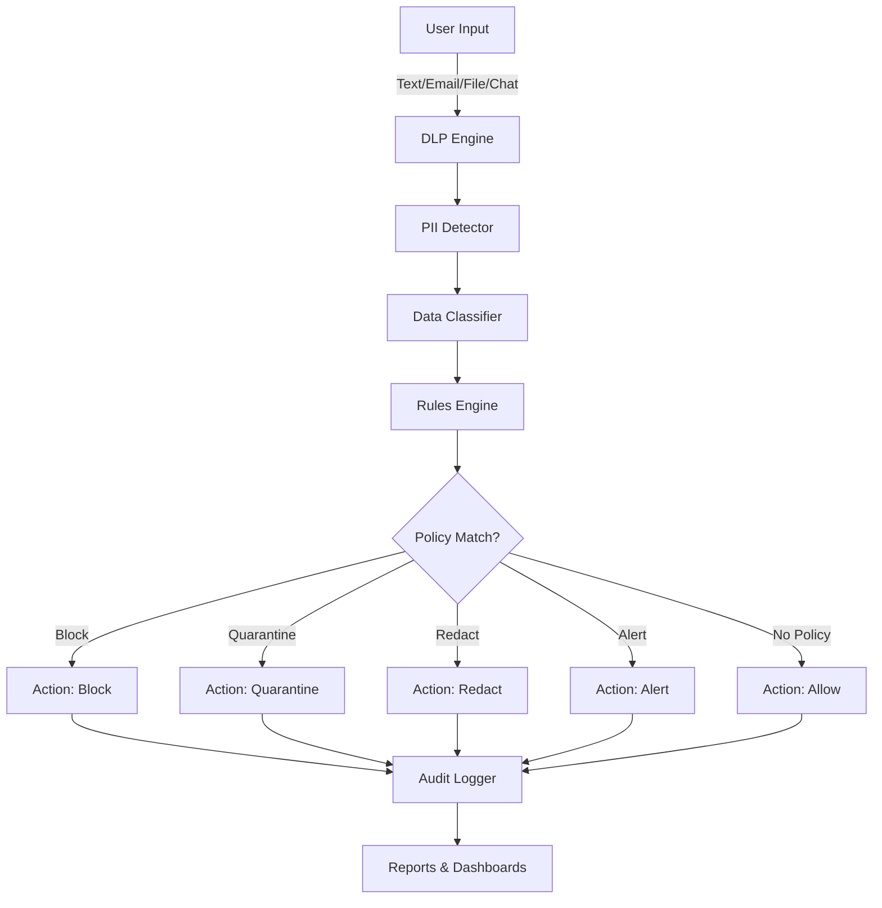

# 🛡️ Data Loss Prevention (DLP) Policy Simulation Platform

[](https://www.python.org/downloads/)
[](https://fastapi.tiangolo.com)
[](https://streamlit.io)
[](LICENSE)

> **Enterprise-grade DLP policy simulation and testing platform with Australian data protection compliance**

## 📋 Overview

The **DLP Policy Simulation Platform** is a comprehensive solution for testing and validating Data Loss Prevention policies in enterprise environments. Built specifically to handle Australian-sensitive data patterns, it provides security teams, compliance officers, and GRC professionals with a powerful sandbox to:

- 🔍 **Detect** sensitive Australian PII (TFN, Medicare, ABN/ACN, BSB, Credit Cards)
- ⚖️ **Enforce** enterprise DLP policies (Block, Quarantine, Redact, Alert)
- 📊 **Visualize** policy effectiveness through an interactive dashboard
- 📝 **Generate** compliance-grade audit logs and reports
- 🧪 **Test** multi-channel data exfiltration scenarios (Email, Chat, File Uploads)

This platform is designed for cybersecurity professionals working in:
- Financial Services (Banks, Fintech)
- Healthcare & Medical
- Government & Defence
- Cloud Security Operations Centers (SOCs)
- GRC & Compliance Teams

---

## 🎯 Why DLP Matters

Data Loss Prevention is a critical control in modern cybersecurity frameworks:

### Regulatory Compliance
- **Australian Privacy Act** – Protection of personal information
- **APRA CPS 234** – Information security for APRA-regulated entities
- **ISO 27001** – Information security management
- **ACSC Essential 8** – Data governance and protection
- **SOCI Act** – Critical infrastructure protection

### Business Risk Mitigation
- Prevent intellectual property theft
- Avoid data breach fines (avg. $4.35M USD per breach)
- Protect customer trust and brand reputation
- Meet contractual data protection obligations

---

## 🏗️ Architecture



### Components

| Component | Technology | Purpose |
|-----------|-----------|---------|
| **Detection Engine** | Python + Regex | Australian PII pattern matching |
| **Rules Engine** | YAML + Python | Policy evaluation and enforcement |
| **API Server** | FastAPI | RESTful API for programmatic access |
| **Dashboard** | Streamlit | Interactive UI for testing |
| **Audit System** | Python Logging | Compliance-grade event logs |
| **Reporting** | Markdown + JSON | Multi-format report generation |

## 📚 Documentation

- [Architecture Overview](docs/ARCHITECTURE.md)
- [API Reference](docs/API_REFERENCE.md)
- [File Structure](FILE_STRUCTURE.md)
- [Quickstart Guide](QUICKSTART.md)
- [Security Policy](SECURITY.md)
- [Code of Conduct](CODE_OF_CONDUCT.md)

---

## 🔍 Detection Capabilities

### Australian PII Detection

| Data Type | Pattern | Example |
|-----------|---------|---------|
| **Tax File Number (TFN)** | `\d{3}\s?\d{3}\s?\d{3}` | `123 456 789` |
| **Medicare Number** | `[2-6]\d{9}` | `2123456789` |
| **ABN** | `\d{2}\s?\d{3}\s?\d{3}\s?\d{3}` | `12 345 678 901` |
| **ACN** | `\d{3}\s?\d{3}\s?\d{3}` | `123 456 789` |
| **Credit Card** | Luhn-valid patterns | `4532-1234-5678-9010` |
| **Mobile** | `04\d{2}\s?\d{3}\s?\d{3}` | `0412 345 678` |
| **Medical Terms** | Keyword matching | `diagnosis`, `patient`, `prescription` |
| **Financial Terms** | Keyword matching | `salary`, `invoice`, `bank account` |

---

## ⚖️ DLP Policy Engine

### Policy Structure

```yaml
policies:
  - name: block_tfn_external
    description: "Block any transmission of Tax File Numbers"
    match: ["TFN"]
    channel: ["email", "chat", "file"]
    action: "block"
    severity: "high"
```

### Enforcement Actions

| Action | Behavior | Use Case |
|--------|----------|----------|
| **Block** | Reject transmission entirely | Highly sensitive data (TFN, Credit Cards) |
| **Quarantine** | Store in isolated location | Suspicious files requiring review |
| **Redact** | Mask sensitive values | Partial blocking for business continuity |
| **Alert** | Generate security event | Low-risk monitoring |
| **Allow** | Permit with logging | Clean content |

### Data Classification

- **🔴 Highly Sensitive**: TFN, Credit Cards, Medicare + Medical context
- **🟡 Restricted**: Medicare, ABN/ACN, Financial terms
- **🔵 Internal**: Email addresses, Mobile numbers
- **🟢 Public**: No sensitive data detected

---

## 🚀 Quick Start

### Prerequisites

- Python 3.11+
- Docker & Docker Compose (optional)

### Installation

```bash
# Clone the repository
git clone https://github.com/yourusername/dlp_platform.git
cd dlp_platform

# Create virtual environment
python3 -m venv venv
source venv/bin/activate  # On Windows: venv\Scripts\activate

# Install dependencies
pip install -r requirements.txt

# (Optional) install development tools
pip install -r requirements-dev.txt
```

### Running Locally

#### Option 1: Streamlit Dashboard (Recommended for Quick Testing)

```bash
streamlit run dashboard/app.py
```

Access at: `http://localhost:8501`

#### Option 2: FastAPI Server

```bash
python api/server.py
```

Access at: `http://localhost:8000`
API Docs: `http://localhost:8000/docs`

#### Option 3: Docker Compose (Full Stack)

```bash
docker-compose up --build
```

Services:
- **Dashboard**: `http://localhost:8501`
- **API**: `http://localhost:8000`

### Configuration

The FastAPI service reads paths for policies and regex patterns from environment variables so you can mount alternate configs wi
thout rebuilding:

- `DLP_POLICIES_PATH` (default: `config/policies.yaml`)
- `DLP_PATTERNS_PATH` (default: `config/patterns_au.json`)

---

## 💻 Usage Examples

### 1. Dashboard Testing

1. Launch the dashboard: `streamlit run dashboard/app.py`
2. Select a simulation mode:
   - **Text Analysis**: Paste content directly
   - **Email Simulation**: Test email scenarios
   - **File Upload**: Scan text files
   - **Chat Message**: Simulate chat DLP
3. View real-time results:
   - Data classification
   - Detected PII matches
   - Policy triggered
   - Action taken
   - Processed output

### 2. API Testing

```bash
# Test email simulation
curl -X POST "http://localhost:8000/simulate/email" \
  -H "Content-Type: application/json" \
  -d '{
    "sender": "user@example.com",
    "recipient": "external@gmail.com",
    "subject": "Payment Details",
    "body": "Please use TFN: 123 456 789 for payment"
  }'

# Response
{
  "email": {...},
  "dlp_result": {
    "classification": "Highly Sensitive",
    "matches": {"TFN": ["123 456 789"]},
    "policy_triggered": "block_tfn_external",
    "action_taken": "block",
    "action_result": {"status": "blocked", "message": "Content blocked by DLP policy."},
    "processed_content": null
  }
}
```

### 3. Running Tests & Quality Checks

```bash
# Run tests
pytest

# Ruff linting
ruff check .

# Formatting verification
black --check .
isort --check-only .
```

---

## 📊 Reports & Logging

### Audit Log (`dlp_audit.log`)

Every DLP evaluation is logged:

```json
{
  "timestamp": "2025-11-21T10:04:38+11:00",
  "event_type": "dlp_evaluation",
  "channel": "email",
  "classification": "Highly Sensitive",
  "policy_triggered": "block_tfn_external",
  "action_taken": "block",
  "user": "user@example.com",
  "metadata": {
    "matches": ["TFN"],
    "action_result": {"status": "blocked"}
  }
}
```

### Markdown Report

Generate human-readable reports:

```bash
# From dashboard: Click "Generate Markdown Report"
# Manual generation in code:
from reporting.reporter import DLPReporter
reporter = DLPReporter()
# ... add events ...
reporter.generate_markdown_report("dlp_report.md")
```

### JSON Summary (SIEM Integration)

Export for security tools:

```bash
reporter.generate_json_summary("dlp_summary.json")
```

---

## 🧪 Example Scenarios

### Scenario 1: Blocked TFN in Email

**Input:**
```
To: external-partner@example.com
Subject: Employee Details
Body: Please process payment for TFN 123 456 789
```

**Result:**
- Classification: `Highly Sensitive`
- Policy: `block_tfn_external`
- Action: `BLOCKED`
- Content: `null` (not sent)

### Scenario 2: Redacted Credit Card

**Input:**
```
Pay with card: 4532 1234 5678 9010
```

**Result:**
- Classification: `Highly Sensitive`
- Policy: `redact_credit_cards`
- Action: `REDACTED`
- Output: `Pay with card: [REDACTED: CreditCard]`

### Scenario 3: Allowed Clean Content

**Input:**
```
Please visit our website at www.example.com
```

**Result:**
- Classification: `Public`
- Policy: `None`
- Action: `ALLOWED`
- Output: `(original content)`

---

## 🔐 Security Considerations

### What This Platform Is

✅ A **testing and simulation environment** for DLP policies  
✅ A **training tool** for security teams  
✅ A **compliance validation** framework  
✅ A **portfolio demonstration** of DLP engineering

### What This Platform Is NOT

❌ Production-ready DLP for real enterprise deployment (without hardening)  
❌ A replacement for commercial DLP solutions (Forcepoint, Symantec, McAfee)  
❌ Suitable for processing actual sensitive data in production

### Production Hardening Checklist

If adapting for production use:

- [ ] Implement secure pattern storage (encrypt regex patterns)
- [ ] Add authentication & authorization (OAuth2, RBAC)
- [ ] Enable end-to-end encryption for data in transit
- [ ] Integrate with enterprise SIEM (Splunk, QRadar, Sentinel)
- [ ] Implement rate limiting and DDoS protection
- [ ] Add database persistence (PostgreSQL, MongoDB)
- [ ] Conduct security audit and penetration testing
- [ ] Implement secrets management (HashiCorp Vault, AWS Secrets Manager)
- [ ] Add comprehensive error handling and input validation
- [ ] Deploy with container orchestration (Kubernetes)

---

## 📁 Project Structure

```
dlp_platform/
├── engine/
│   ├── __init__.py
│   ├── pii_detector.py       # Pattern matching engine
│   ├── classifier.py         # Data classification logic
│   ├── rules_engine.py       # DLP policy evaluation
│   └── actions.py            # Enforcement actions
├── api/
│   └── server.py             # FastAPI REST API
├── dashboard/
│   └── app.py                # Streamlit UI
├── reporting/
│   ├── audit_logger.py       # Compliance logging
│   └── reporter.py           # Report generation
├── config/
│   ├── patterns_au.json      # Australian PII regex
│   └── policies.yaml         # DLP rules
├── examples/
│   └── sample_text/          # Test data
├── tests/
│   ├── test_pii_detector.py
│   ├── test_classifier.py
│   └── test_rules.py
├── docker-compose.yml
├── Dockerfile.api
├── Dockerfile.dashboard
├── requirements.txt
├── .gitignore
└── README.md
```

---

## 🧑‍💼 Professional Context

### Resume Bullet Point

> *"Built an enterprise-grade Data Loss Prevention (DLP) Policy Simulation Platform capable of detecting Australian-sensitive data (TFN, Medicare, ABN/ACN), enforcing multi-channel DLP rules (Block/Redact/Quarantine), and generating compliance audit logs aligned with APRA CPS 234 and ISO 27001."*

### Skills Demonstrated

- **Cloud Security Engineering**: DLP architecture, policy enforcement
- **GRC**: Compliance logging (APRA, Privacy Act, ISO 27001)
- **Python Development**: FastAPI, Streamlit, YAML parsing
- **DevOps**: Docker, containerization, microservices
- **Testing**: Unit tests, integration tests, TDD
- **Documentation**: Technical writing, architecture diagrams

---

## 🤝 Contributing

This is a portfolio/demonstration project. If you'd like to extend it:

1. Fork the repository
2. Create a feature branch: `git checkout -b feature/your-idea`
3. Commit changes: `git commit -am 'Add new feature'`
4. Push: `git push origin feature/your-idea`
5. Open a Pull Request

---

## 📜 License

This project is licensed under the MIT License - see the [LICENSE](LICENSE) file for details.

---

## 🌟 Acknowledgments

- **Australian Privacy Principles** for data protection guidelines
- **APRA CPS 234** for information security standards
- **ACSC Essential Eight** for baseline security controls
- Commercial DLP vendors (Forcepoint, Symantec) for industry patterns

---

## 📧 Contact

**Raouf**  
*Cybersecurity Portfolio Project*

For questions or professional inquiries, please open an issue on GitHub.

---

## 🚀 Roadmap

Future enhancements (not currently implemented):

- [ ] Machine learning-based anomaly detection
- [ ] Support for binary file scanning (PDF, DOCX)
- [ ] Integration with Azure Information Protection
- [ ] Real-time streaming data monitoring
- [ ] Multi-language support (currently English only)
- [ ] Custom pattern builder UI
- [ ] Historical trend analysis dashboard
- [ ] Automated policy tuning recommendations

---

**Built with ❤️ for the Australian cybersecurity community**
