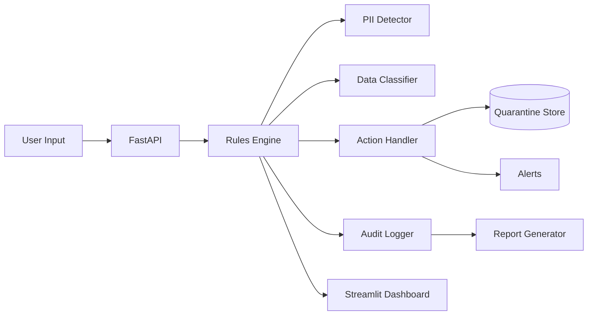

# Architecture Overview

This document provides a concise overview of the Data Loss Prevention (DLP) Policy Simulation Platform, its primary components, and data flows.

## High-Level Diagram

## Component Responsibilities

| Component | Technology | Responsibilities |
| --- | --- | --- |
| **FastAPI** (`api/server.py`) | FastAPI | Exposes simulation endpoints for text, email, chat, and file uploads. Validates payloads and returns rich results. |
| **Rules Engine** (`engine/rules_engine.py`) | Python | Orchestrates detection, classification, policy selection, and enforcement actions. |
| **PII Detector** (`engine/pii_detector.py`) | Python + Regex | Loads compiled regex patterns and scans text for Australian-sensitive PII. |
| **Classifier** (`engine/classifier.py`) | Python | Assigns sensitivity labels based on detected PII types. |
| **Action Handler** (`engine/actions.py`) | Python | Applies enforcement actions (block, quarantine, redact, alert). Persists quarantined artifacts. |
| **Audit Logger** (`reporting/audit_logger.py`) | Python Logging | Emits structured audit events for every evaluation. |
| **Reporter** (`reporting/reporter.py`) | Python | Generates Markdown and JSON summaries from accumulated events. |
| **Dashboard** (`dashboard/app.py`) | Streamlit | Interactive UI for manual simulation and visualization. |

## Data Flow

1. **Inbound Request**: Payload arrives via the FastAPI endpoints or Streamlit dashboard.
2. **Detection**: `PIIDetector` loads patterns from `config/patterns_au.json` and returns grouped matches.
3. **Classification**: `DataClassifier` assigns a label (`Highly Sensitive`, `Restricted`, `Internal`, or `Public`).
4. **Policy Evaluation**: `DLPEngine` filters policies by channel, prioritizes by action severity, and selects the highest-priority match.
5. **Action Execution**: `ActionHandler` performs block/quarantine/redact/alert and returns a structured result.
6. **Auditing**: `AuditLogger` records the evaluation for compliance tracking; `DLPReporter` can render reports.
7. **Response**: The API returns the enforcement outcome and any modified content (e.g., redacted text).

## Configuration

- **Patterns**: `config/patterns_au.json` defines regexes for sensitive data types.
- **Policies**: `config/policies.yaml` defines actions, channels, and match criteria.
- **Logging**: `reporting/audit_logger.py` writes events to `dlp_audit.log`; adjust via environment or container mounts.

## Observability & Security

- Structured audit events ensure traceability for every evaluation.
- Quarantined content is stored locally in the `quarantine/` directory with metadata; protect this path with OS permissions when deployed.
- CORS is open by default for demos; tighten origins for production deployments.

